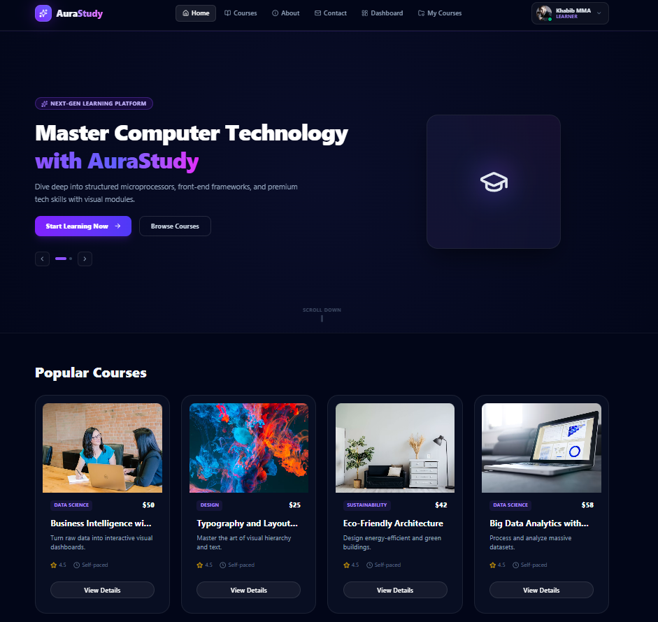

<div align="center">
  
  
  # 🚀 AuraStudy — Modern Learning Management System

  <p>A feature-rich, high-performance, and beautifully designed educational platform built for modern students, instructors, and administrators.</p>

  <!-- Badges -->
  <p>
    
    
    
    
    
  </p>

  <h3>
    <a href="https://aurastudy-rouge.vercel.app/" target="_blank">🌐 Live Demo</a>
    <span> · </span>
    <a href="https://github.com/SBHimel/AuraStudy-server" target="_blank">🖥️ Backend Server Repo</a>
  </h3>
</div>

---

## ✨ Overview

**AuraStudy** is a cutting-edge EdTech web application designed to bridge the gap between seamless learning and efficient classroom management. With an immersive dark-mode UI, fluid animations powered by Framer Motion, and robust role-based navigation, AuraStudy delivers an exceptional digital learning experience.

---

## 🌟 Key Features

- **🔐 Advanced Authentication (Better Auth):** Secure email/password login alongside seamless Google SSO integration.
- **⚡ 1-Click Demo Login:** Built-in evaluator shortcut allowing instructors and examiners to instantly test the student dashboard with a single click.
- **👥 Role-Based Dashboards:** Tailored interfaces and routing for Students, Instructors, and Administrators.
- **🎨 Modern UI/UX:** Crafted using **HeroUI** and **Tailwind CSS** with glowing accents, glassmorphism, and responsive components.
- **⚡ Smooth Micro-Animations:** Enhanced user engagement powered by `framer-motion`.
- **🔔 Real-time Feedback:** Integrated with `react-hot-toast` for clean, non-intrusive notification alerts.

---

## 🛠️ Tech Stack

### **Frontend (Client)**
- **Framework:** [Next.js](https://nextjs.org/) (App Router)
- **UI Library & Components:** [HeroUI](https://heroui.com/) & Tailwind CSS
- **Authentication Client:** Better Auth Client
- **Animations:** Framer Motion
- **Icons:** Lucide React
- **Notifications:** React Hot Toast

### **Backend & Deployment**
- **Server Repository:** [AuraStudy-server](https://github.com/SBHimel/AuraStudy-server)
- **Deployment Platform:** Vercel

---

## 🚀 Quick Start (Local Development)

Follow these steps to run the client-side project locally on your machine:

1. **Clone the repository:**
   ```bash
   git clone [https://github.com/SBHimel/AuraStudy.git](https://github.com/SBHimel/AuraStudy.git)
   cd AuraStudy


   Install dependencies:

Bash
npm install
# or
yarn install
Configure Environment Variables:
Create a .env.local file in the root directory and add your credentials:

Code snippet
BETTER_AUTH_URL=http://localhost:3000
NEXT_PUBLIC_API_URL=your_backend_server_url
GOOGLE_CLIENT_ID=your_google_client_id
GOOGLE_CLIENT_SECRET=your_google_client_secret
Run the development server:

Bash
npm run dev
# or
yarn dev
Open your browser:
Navigate to http://localhost:3000 to view the application.

🤝 Evaluator Note
If you are evaluating this project, you can use the 1-Click Demo Login directly on the sign-in page to instantly bypass manual registration and explore the student dashboard!

👨‍💻 Author
Developed with passion by Himel.
Feel free to reach out or drop a ⭐ if you like this project!